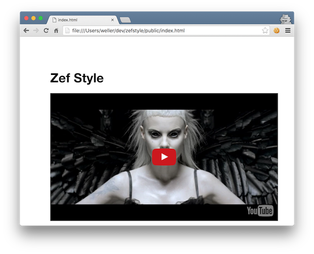

#Zef Style
### An experiment in importing React components from npm, via webpack, to a Clojurescript/Reagent app. See [this blog post](http://blob.tomerweller.com/reagent-import-react-components-from-npm) for more details.

Javascript build:

```bash
npm install && npm run build
```

Clojurescript build (with fighweel):

```bash
lein fighweel
```

while it's running, open `public/index.html`

You should see: 

